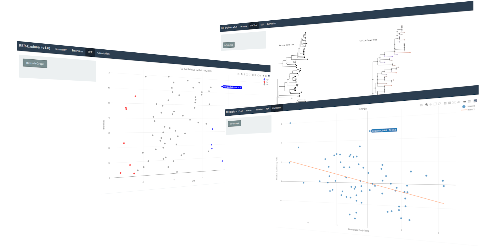

## Welcome to shinyRER

The shinyRER package was built to display the results of an RERConverge analysis. RERConverge correlates relative evolutionary rates of individual genes to a phenotype. Genes with a high rho correlation are ones whose evolution best correlates with the supplied phenotype. For each gene, a phylogenetic tree is constructed whose relative branch lengths to the average tree signal particular species with an accelerated or diminished evolutionary rate. The results of these analyses are contained in `shipping_container.zip` and are displayed in the web-based interactive shiny dashboard.  

## Installation Guide

Follow these steps to install and run the application:

### Prerequisites
- A terminal/command line interface
- Internet connection

### Installation Steps

1. Install Docker using snap:
   ```bash
   snap install docker
   ```

2. Pull the Docker image:
   ```bash
   docker pull dbioinfo/shinyrer
   ```

3. Unzip the provided data:
   ```bash
   unzip shipping_container.zip -d tmp/
   ```
   This will extract the contents into a directory called `tmp/`

4. Run the Docker container:
   ```bash
   docker run -p 3838:3838 -v ./tmp:/data dbioinfo/shinyrer
   ```
   This command:
   - Maps port 3838 from the container to your local machine
   - Mounts the local `tmp/` directory to `/data` in the container

5. Access the application:
   Open your web browser and navigate to:
   ```
   http://localhost:3838/shinyrer/
   ```

### Troubleshooting

- If you encounter permission issues with Docker, you may need to run the commands with `sudo`
- Ensure ports are not already in use by another application
